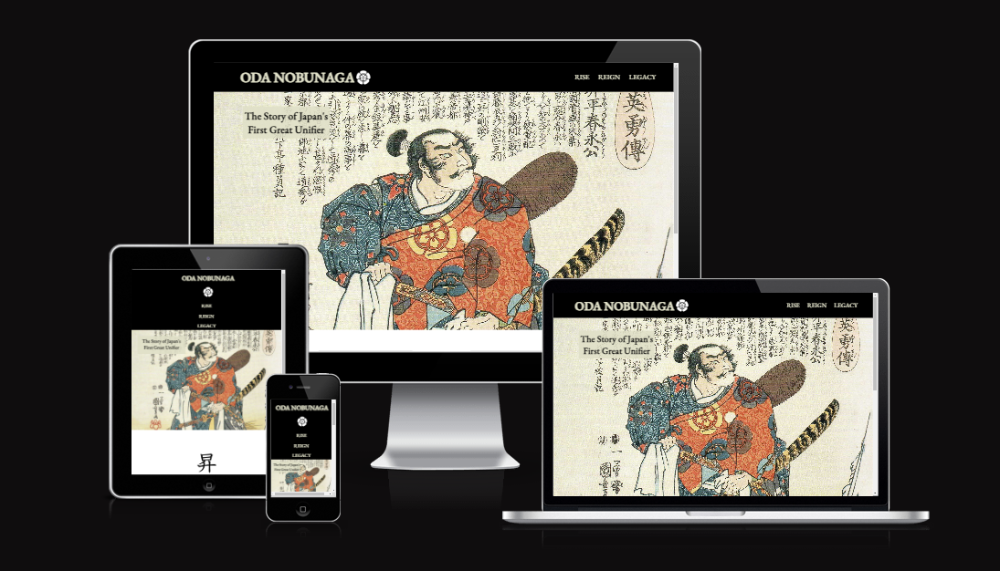
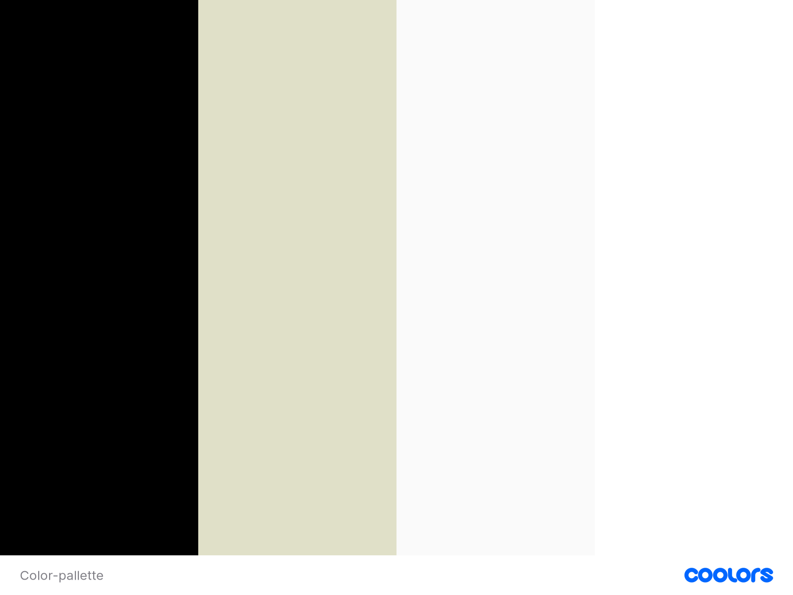
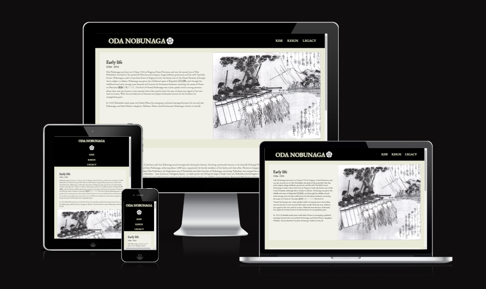
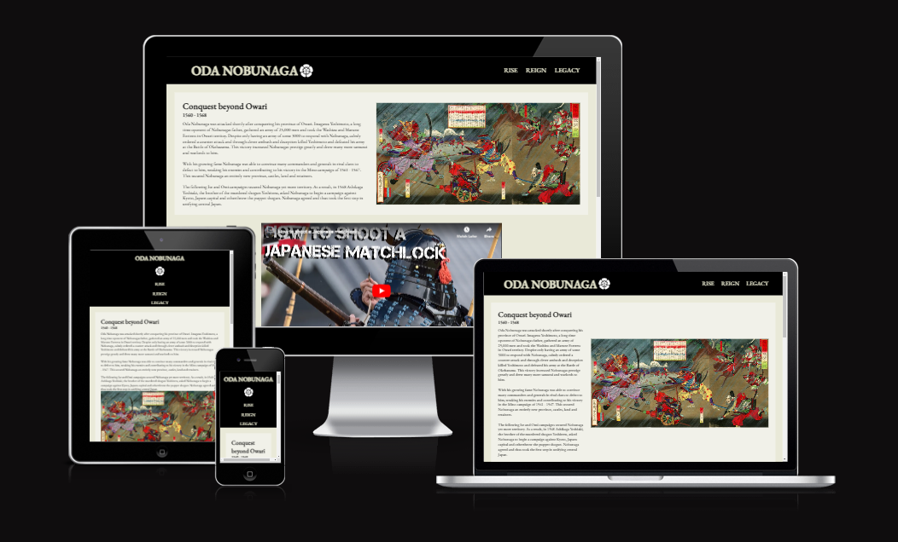
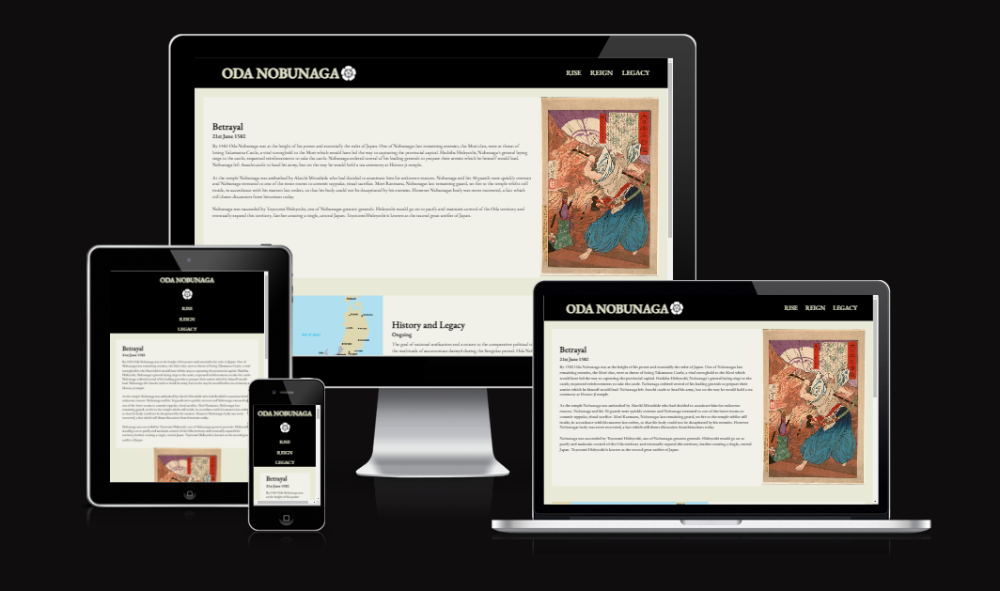
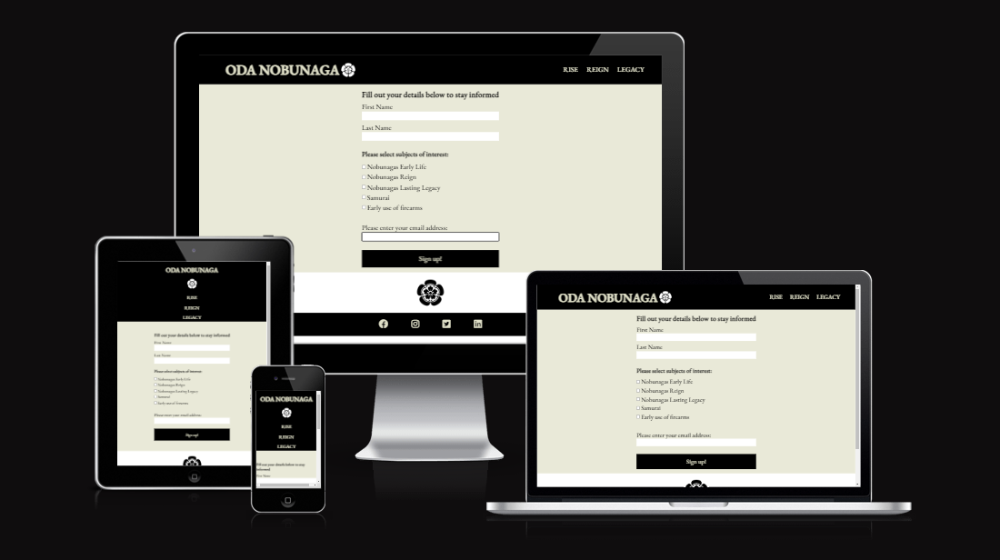
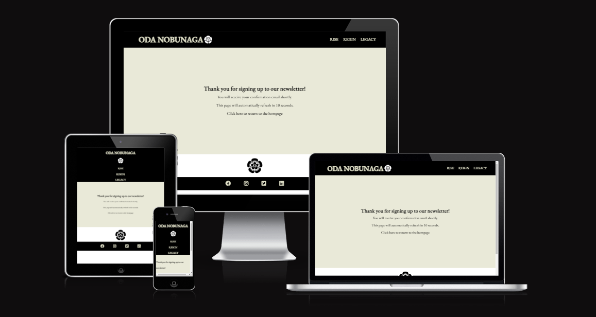
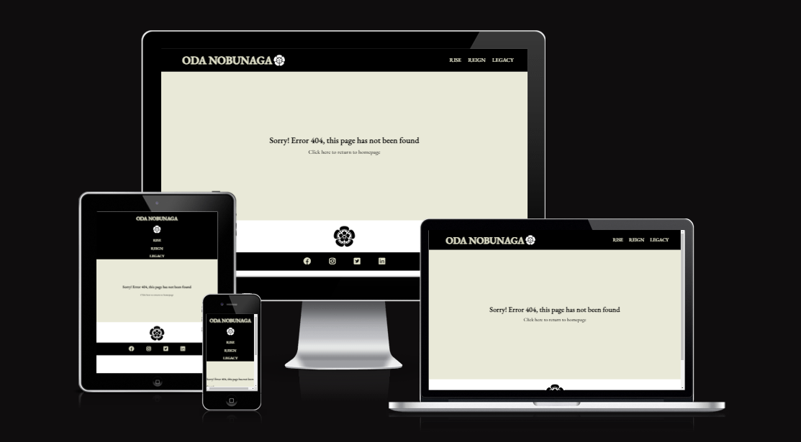

# Oda Nobunaga, Japans First Great Unifier

## Overview

This project was intended to provide engaging and useful information for audiences interested in learning about early Japanese history, feudal systems and the origins of the samurai by telling the story of Oda Nobunaga. Nobunaga is a key figure in Japanese history and many of the most characteristic traits of Japanese culture have been influenced in some way by his life. The story of Nobunaga is historically important, but also provides context and understanding on the origins of many aspects of Japanese life and modern culture. His story itself is exciting and often brutal, with plenty of rich detail to draw on.

This website was intended to give a level of detail that would appeal to history enthusiasts, but also be presented in an accessible, easy to navigate fashion so that newcomers to the information would be drawn in and want to keep exploring and learning more. I chose this as the subject for this site as I personally find it very interesting and I also feel the timeline of events lends itself well to a natural progression of content to keep a user interested and engaged.

Please use the link below to view the live, deployed site:

[Oda Nobunaga Live Site](https://tomlidev.github.io/Oda-Nobunagav1/)

## User Experience

Oda Nubanaga, Japans First Great Unifier, is a website which provides interesting, easy to navigate content for a range of users with various interests and content requirements.

Key Information:

- Who: Who Oda Nobunaga was, what kind of personality he was, what he is known for, what is unusual about him.
- When: The key miletsones of Nobunagas life and stages of his story, as well as dates for key events.
- What: The particularly notable things Nobunaga did, events, battles, alliances, marriages etc.
- Historical Impact: The lasting effects of his life, what he laid the foundation for any events which would not have happened without him.

### User Stories

#### First Time Visitors

As a first time visitor I want to find out more about Oda Nobunaga to understand how and why he is important in Japanese history. I want the main facts about him presented clearly so I can decide if his story is one I want to learn about. I want to use the information to add to my own research on a specific element of Japanese history, or to understand Japanese culture more broadly.

#### Return Visitor

As a return visitor I have taken on board some information on Nobunaga already and now want to find information on a particular influence/time/event in his life. I want to be able to navigate to this quickly and easily so I am not forced to re-read content and be presented with new information quickly.

#### History Enthusiast User

As a user who is interested in history I want to be able to understand how Oda Nobunaga fits in with broader Japanese history whilst also be able to quickly understand timelines, phases and dates of specific events in line with the study of history. I also want access to deeper, richer historical detail on Nobunaga so I can determine for myself how important or unique he may be.

#### Samurai/Military Enthusiast User

As a user who is interested in learning more about the samurai I want quick, easy access to this specific content so I can determine how/why Nobunaga is important in their story. I am less likely to readily engage with large sections of text so eye catching images/graphical content on the weaponry, tactics, battles etc of samurai will be needed to draw me in.

## Design

### Colour Scheme

I wanted a colour scheme which provided good contrast between text/headers and backgrounds for easy navigation which also didn't detract from the main images. I wanted the images to be stand out and be as striking as possible, so opted for a relatively neutral palette.

Many of the images I used for the project are digital copies of original Japanese artwork produced at the time, paintings on parchment and similar materials, which had a straw-like yellow/faded white colour to them. I used this colour as the background for many of the site pages, and it worked well blending the background images and giving contrast for headings and text. I also used the same colour for the font on the nav bar items, to provide consistency and I think it looks better here than plain white.

For the section on the homepage where Japanese characters are used I decided to keep the background pure white as this gave better contrast between the characters. It also helped to act as something of a page break from the hero image.

I toyed with the idea of using bold red text on the white, to match the Japanese flag, but felt this looked to garish.

### Typography

I used the EB Garamond font from google fonts for the site. I experimented with other font types for the body and header/footer sections but felt that making the header text capitalised, and in a slightly different colour gave enough diffrentiation from the body text.

[Image of Garamond, Font Used on Website](documentation/garamond.PNG)

Choosing a font was time consuming as it was difficult to find something which gave a historical feel, without looking too much like Times New Roman.

San's serif is used as the back-up font if EB Garamond cannot be loaded for any reason.

### Imagery

Fortunately there are a number of high quality historical images digitally reproduced from original Japanese artwork that I will use throughout the site. This includes images of Nobunaga himself, his military units, battles and castles. These images are impressive and also maintain the historical theme as users navigate the site. However I decided to use modern maps where relevant as the historical maps, whilst pretty, were difficuilt to read and I wanted to give a clear indication of territory/expansion as information. I specifically didn't want to use photos or modern-style representations of samurai as I feel this wouldn't have fit with the historical theme of the site.

### Wireframes

Please use the links below to view the relevant wireframe.

[Homepage Wireframe](https://share.balsamiq.com/c/v3qHooymfGyyEyCx9uEb9t.png)

[Rise Page Wireframe](https://share.balsamiq.com/c/4XHgkXZpHDEm6hsLnyTWFw.png)

[Reign Page Wireframe](https://share.balsamiq.com/c/dZwjwN7p92MaoszVH6QtVR.png)

[Legacy Page Wireframe](https://share.balsamiq.com/c/nqA2hcoZaDui433BzNUciM.png)

[Homepage Mobile Wireframe](https://share.balsamiq.com/c/kboxySvsPoZ6vGataXtcPX.png)

[Rise Page Mobile Wireframe](https://share.balsamiq.com/c/pRRHV5QAdkH1ZwD97XFLDr.png)

[Reign Page Mobile Wireframe](https://share.balsamiq.com/c/xgnLqqmHmFKpsLG5Rzr7hB.png)

[Legacy Page Mobile Wireframe](https://share.balsamiq.com/c/h6eQVWLUi3Vt7jMPAzWmto.png)

[404/Thank you page, Desktop and Mobile Wireframe](https://share.balsamiq.com/c/tzDT9VJSwPWJCvZkviFija.png)

[Form page Desktop and Mobile Wireframe](https://share.balsamiq.com/c/8oWTJvxPUwHagAJNFR4EmU.png)

## Features

### General Features On All pages

#### Header/Nav Bar

Every page has the same navigation bar at the top, comprising Oda Nobunaga (the name as it is) in the top left of the nav bar as an anchor back to the homepage. Immediatly to the right is a small image of the Oda house crest. To the right of the nav bar are Rise, Reign and Legacy links, which take the user to the relevant page. This facilitates simple and clear navigation to the relevant page of interest, and back to the home, from any page.

#### Footer

Every page has the same footer bar comprising icon links to Facebook, Instagram, Twitter and Linkedin.

### Homepage

On the homepage the user is presented with the hero image of Oda Nobunaga with a stap-line text section appearing in the top left as a very brief explanation of what the site is about. Below this are the 3 Japanese characters representing Rise, Reign and Legacy, showing the relevant years of these phases of Nobunaga's life and a brief text explanation of the time period. The character and time sub heading are wrapped in anchor which also links the user to the relevant page. This section acts as a secondary prompt to explore another page of the site through visually appealing links, with more explanation of these pages for a user who is more detail-focused.

### Rise page

The rise page is comprised of 2 vertically seperate sections. The first details Nobunagas early life with an image of Ashigaru, a military unit he made famous. All text sections across the rise, reig and legacy pages are comprised of a title, sub title with a date(s) and the main text content itself.

The second section details the Unification of Owara. Below this is a map with a slowly-zooming in animation effect. This was chosen for 2 reasons, firstly I wanted to create the impression of how many other territories surrounded Nobunaga, and secondly with it at the bottom of the page I wanted to increase the chance the user would actually see it.

### Reign page

The reign page is comprised of 2 vertically seperate sections. The first gives details of Conquest beyond Owari, with a large, fantastically colourful image to the right, of one of the key battles.

Beneath this is a iframe element containing an embedded Youtube video on Japanese matchlock weapons. I wanted to incorporate media that was more dynamic than simple text and images and bring the technology of the day alive and more real.

Below this, above the footer, is the Unification of Japan section which gives further detail on Nobunagas campaigns and eventual conquest of the country. A large image of Azuchi castle is to the right of the text.

### Legacy page

The legacy page is comprised of 2 vertically seperate sections. The first is split with text on the left and an image on the right of Nobunagas betrayal and assasination.

Below this is the final content section detailing Nobunagas legacy and ongoing historical significance. In this section the map to the left of the text takes up half of the section and shows the total territoy eventually conquered by Nobunaga and his ally. I wanted this image ot be large, partly so the legend of the map is readable, but also to show clearly the extent of conquest from his starting point.

### Sign Up Form

The sign up form is the call to action of the site and gives a mechanism for additional information in the future, which will act to encourage repeat visits. Specifically a user is prompted to enter their details and select which topics they would like to be kept informed on from the newsletter, ensuring a consistent flow of relevant information from that point on.

### Thank you page

A response page for users to see and confirm that they have successfully signed up the newsletter was added. This page was originally built with an automatic refresh every 10 seconds, this was later increased to 30 seconds, and then finally removed altogether. The reasons behind this are explained in the testing.md. Instead a clickable link back to the homepage is included to facilitate return to the main site and continued use.

### 404 Error Page

A simple, responsive customised 404 page was built with a link to redirect the user back to the home page.

## Future Implementations/Plans

In the future I would like to incorporate more video elements on the fighting styles and tactics introduced by Nobunaga as I feel these would broaden the audience of the website and make the other content more alluring.

There are so many signficant individuals and events in this story it is difficult to balance including detail, with keeping the view uncluttered and easy to navigate. Incorporating more links in the text sections themselves would help with this, as it would facilitate navigation directly to those people/events.

It would also have been fantastic to incorporate animation into the homepage, so that when the user scrolls down to the characters section, these actually appeared on s
creen at that time, as if they were being painted on as the user scrolled down.

### Accessibility

This site will be built to be as accessible as possible, specifically:

- All images have alt text attributes and all anchors have aria labels for use by screen readers.
- The colour scheme has been chosen to ensure a good level of contrast is maintained for text across the site.
- Semantic markup has been used throughout.
- Including hover states to aid navigation.

## Technologies Used

### Languages Used

HTML and CSS whhere used.

### Libraries and External Sources

- Git - Version control.
- Github - To save and store code for the website itself.
- Github pages - To deploy the live site.
- Code anywhere - The workspace and IDE for producing the site.
- Balsamiq - wireframes
- Google fonts - For imported fonts
- Font Awesome - For social media icons
- Google Developer Tools - For troubleshooting/bug resolution and testing responsiveness
- W3C Validators - For checking validity of HTML and CSS.
- Am I Responsive? - To create images of website on range of device screens.

## Deployment

This was website was deployed using Github pages. Instructions to do this are:

1. Log in (or sign up) to Github.
2. Find the repository for this project, TomLiDev/Oda-Nobunagav1.
3. Click on the Settings link.
4. Click on the Pages link in the left hand side navigation bar.
5. In the Source section, choose main from the drop down select branch menu. Select Root from the drop down select folder menu.
6. Click Save. Your live Github Pages site is now deployed at the URL shown.

## Local Development

### How to fork

1. Log in (or sign up) to Github.
2. Go to the repository for this project, TomLiDev/Oda-Nobunagav1.
3. Click the Fork button in the top right corner.

### How to clone

1. Log in (or sign up) to GitHub.
2. Go to the repository for this project, TomLiDev/Oda-Nobunagav1.
3. Click on the code button, select whether you would like to clone with HTTPS, SSH or GitHub CLI and copy the link shown.
4. Open the terminal in your code editor and change the current working directory to the location you want to use for the cloned directory.
5. Type 'git clone' into the terminal and then paste the link you copied in step 3. Press enter.

## Testing

Please see seperate testing.md for full details.

[Testing](TESTING.md)

Testing was conducted at several stages throughout the development using Google Chrome Developer tools and later W3C validators.

Early issues identified in meetings with my mentor were:

- Including Alt tags on all images.
- Where possible using images with webp format, not JPEG or PNG to reduce load time.
- Using more comments in HTML to aid developer navigation.

Later issues on first deploying my website, reviewed with my mentor were:

- Images not loading properly, required a change in image path link.
- Images scaling appropriately across multiple screen sizes/media queries.
- Some styling issues where sections with relatively small text were dwarfed by large images.

### W3C Validator

The W3C validator was used to validate all HTML pages and CSS in the style.css.

- [Screenshot of CSS W3C Validated](documentation/css-validated.PNG)
- [Screenshot of index page W3C Validated](documentation/index-validated.PNG)
- [Screenshot of rise page W3C Validated](documentation/rise-validated.PNG)
- [Screenshot of reign page W3C Validated](documentation/reign-validated.PNG)
- [Screenshot of legacy W3C Validated](documentation/legacy-validated.PNG)

### Solved Bugs

1. Navbar elements - The navbar elements were challenging to keep centered, particularly in creating the vertical display of items for smaller device screens. My mentor suggested using Flexbox instead of floats/padding and this provided a much simpler way to switch the row into a column at a particular pixel screen size. Some final fine tuning in removing padding at smaller screen sizes keeps the items centered.

2. Hover on Characters - Creating the pseudo class for hovering over the character links was challenging and presented a series of styling issues. Firstly creating a page layout which would display all 3 characters in even sections, then later to create a container which would wrap around the character image, and the date below it. Then the hover class against the container needed to be as circular as possible, without cutting off/overlapping other aspects. Re-coding this section as flexbox helped with this but it took a great of time with Chrome developer tools to identify styling which would display the character links in the desired way on larger and smaller screens. Eventually I deciced to have the characters take a vertical column display at a relatively large screen size which helped resolve the issue.

3. Scaling image size for smaller screens - Finding styling which resized images at smaller mobile-size screens suitably took time, many of the images would extend beyond the rest of the page width, causing a horizontal scroll bar to be displayed. After trying many combinations of padding/margin, I found styling of height: auto with width 100% (or vice versa), in combination with the image being displayed below its corresponding text, was on of the simplest and effective ways to scale images to screen size without impacting aspect ratio.

4. Legacy text and image sections - Whist not strictly a bug, the Betrayal, and in particular the Histroy and Legacy sections on the Legacy page, held a relatively small amount of text compared to the images. This left a lot of blank space below these text sections, which looked a bit odd. Vertically centering the text relative to the image with the align-items flex attribute meant that the text aligned more nicely to the image, but cut off the remaining background area which wasn't occupied by text, giving a mismatch between the top and bottom of the image and the text box. After experimenting with various possible solutions, I opted for a relatively simple padding-top rule for these sections where there is relativley little text compared to the size of the image, this keeps the text aligned better with the image without damaging the consistency of the overall display and navigation.

5. 'Oneliner' - The Story of Japans First Great Unifier - Originally the homepage was just the hero background image below the header, however I felt this was stark and something was needed to break up the image and give an idea on what the website was about. To introduce and position the 'oneliner' section I had to add position attributes to the background to make the oneliner absolute. This introduced issues for responsiveness, however the alternative was to try and float the text, which was difficult over different screen sizes. So although the oneliner required quite a lot of styling for one small aspect of the site, due to its absolute position, I felt this was the most efficient route and am pleased with the end result.

### Known Issues

1. On the homepage, the image for the legacy character, being actually 2 characters not 1, and a larger image just overlaps the black circle which is shown on hover for this link. This is a minor aethestic issue and has no a minor aspect on experince, the alternative to fix this would have meant having a larger circle and link for the legacy character, which would have been inconsistent and caused issues with the structure and styling.

2. Map on Rise Page - This map has proven challenging to get displaying correclty on different screen sizes. To include the entire map on a desktop size screen requires the background-size to be set very small, less than 50%, which looks bad very quickly on any screens smaller than 'full' monitor size. Therefore the background-size increases as a percentage as screen size gets smaller, which keeps the map a good size on the screen itself whilst also loosely maintaining a focus for the map to show the centre, in which Nobunagas territory is surrounded by enemies, which is the whole point of the graphic. However, with the zoom effect, at certain screen sizes parts of the map are cut off at certain points of the zoom. For the most part this isn't too problematic as the key centre of the map with surrounded Nobunaga is always shown, but it is visually distracting at certain screen sizes. I considered removing the zoom all together, but I felt even with some of the text being cut at certain screen sizes, the zoom effect was still good, and helped convey the point of being surrounded, so I kept it in.

## Credits

### Code Used

The following sites were used for code on embedding the YouTube video:

https://www.w3schools.com/html/html_youtube.asp
https://stackoverflow.com/questions/32426401/embeded-youtube-video-error

### Content

The bulk of the text information came from Wikipedia, although many of the sections summaries were written by the website author Tom Litchfield. The images came from Wikipedia.

https://en.wikipedia.org/wiki/Oda_Nobunaga
https://en.wikipedia.org/wiki/Sengoku_period

The maps came from the following sites:

https://www.edmaps.com/html/japan.html
[Legacy Map](https://www.nippon.com/en/japan-topics/b06905/oda-nobunaga-and-the-struggle-to-unify-japan.html)

## Acknowledgements

- Graeme Taylor - My Code Institute Mentor
- My family - For your help in testing and giving feedback on my first website.
