# Oda Nobunaga - Testing

## Testing

Testing was conducted at several stages throughout the development using Google Chrome Developer tools and later W3C validators.

Early issues identified in meetings with my mentor were:

- Including Alt tags on all images.
- Where possible using images with webp format, not JPEG or PNG to reduce load time.
- Using more comments in HTML to aid developer navigation.

Later issues on first deploying my website, reviewed with my mentor were:

- Images not loading properly, required a change in image path link.
- Images scaling appropriately across multiple screen sizes/media queries.
- Some styling issues where sections with relatively small text were dwarfed by large images.

## Automated Testing

### W3C Validator

The W3C validator was used to validate all HTML pages and CSS in the style.css.

- [Screenshot of CSS W3C Validated](documentation/css-validated.PNG)
- [Screenshot of index page W3C Validated](documentation/index-validated.PNG)
- [Screenshot of rise page W3C Validated](documentation/rise-validated.PNG)
- [Screenshot of reign page W3C Validated](documentation/reign-validated.PNG)
- [Screenshot of legacy W3C Validated](documentation/legacy-validated.PNG)
- [Screenshot of form page W3C Validated](documentation/form-validated.PNG)
- [Screenshot of thank you page W3C Validated](documentation/thankyou-validated.PNG)
- [Screenshot of 404 error page W3C Validated](ocumentation/404-validated.PNG)

### Lighthouse Testing

Google chrome Lighthouse tester was used to assess SEO score, acccessibility, conformance to best practices and overall performance. Please use the links below to view scores for each page on desktop or mobile:

#### Homepage Desktop Lighthouse Scores

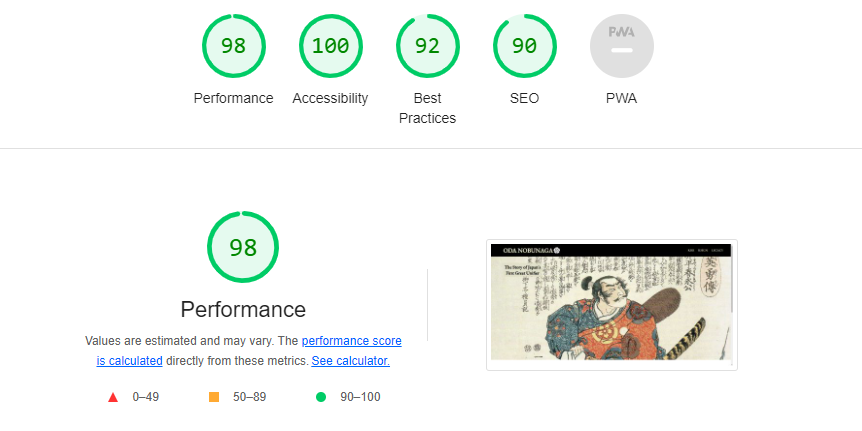

#### Homepage Mobile Lighthouse Scores

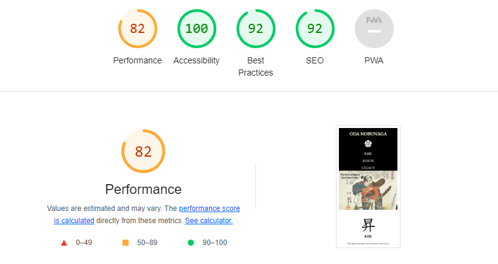

#### Rise Desktop Lighthouse Scores

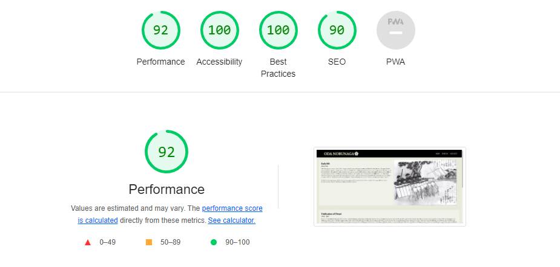

#### Rise Mobile Lighthouse Scores

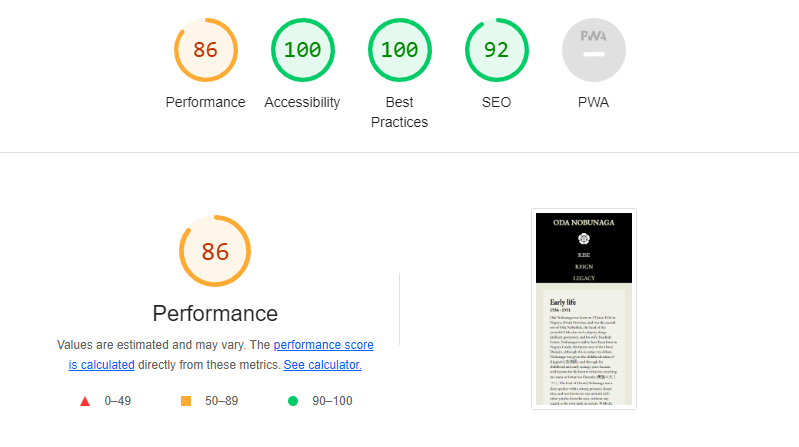

#### Reign Desktop Lighthouse Scores

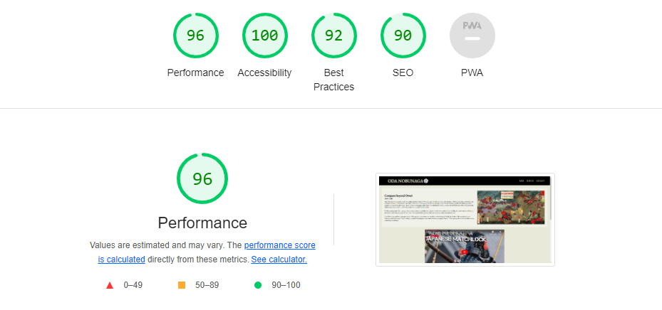

#### Reign Mobile Lighthouse Scores

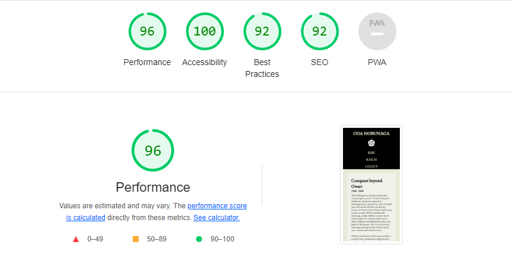

#### Legacy Desktop Lighthouse Scores

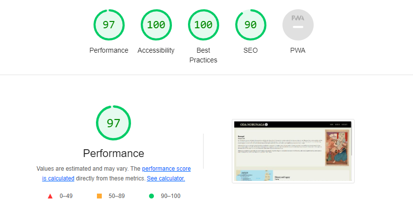

#### Legacy Mobile Lighthouse Scores

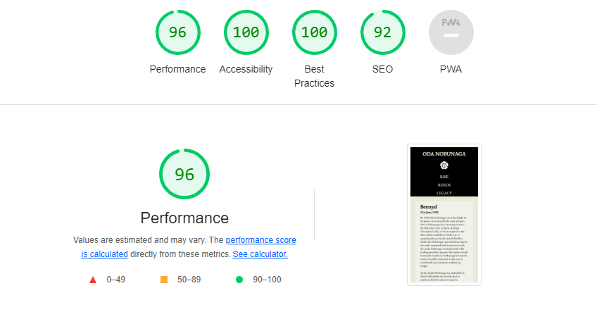

#### Form Desktop Lighthouse Scores

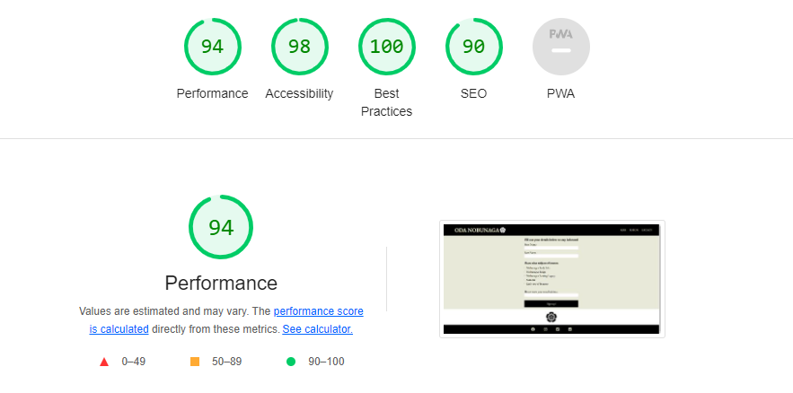

#### Form Mobile Lighthouse Scores

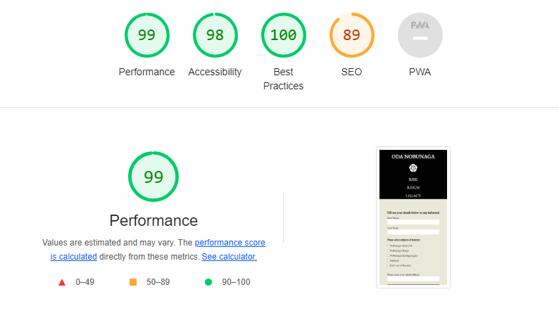

#### Thankyou Desktop Lighthouse Scores

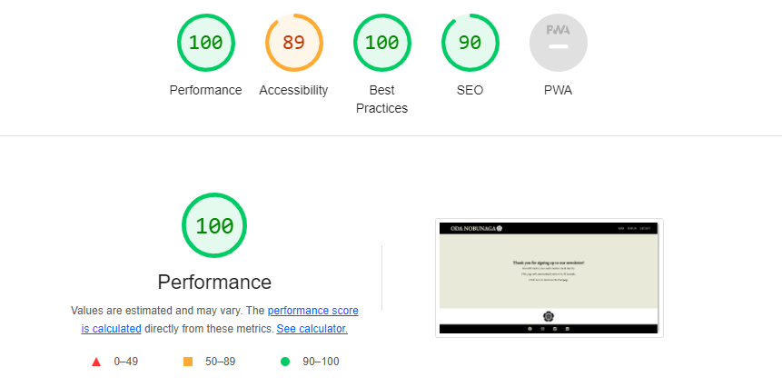

#### Thankyou Mobile Lighthouse Scores

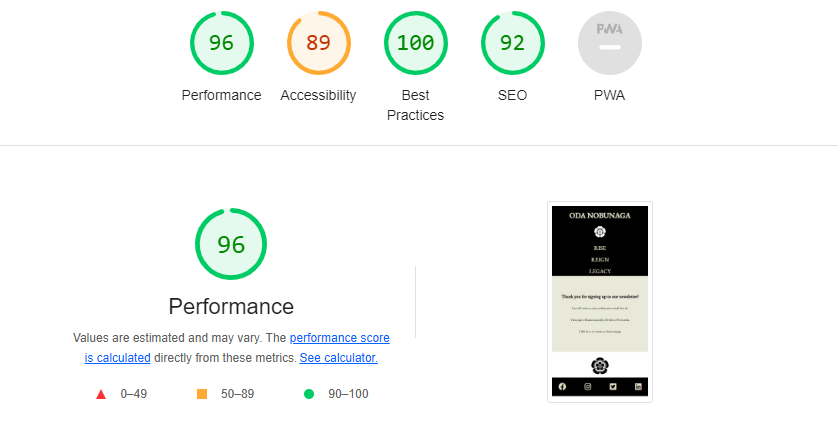

#### 404 Error Page Desktop Lighthouse Scores

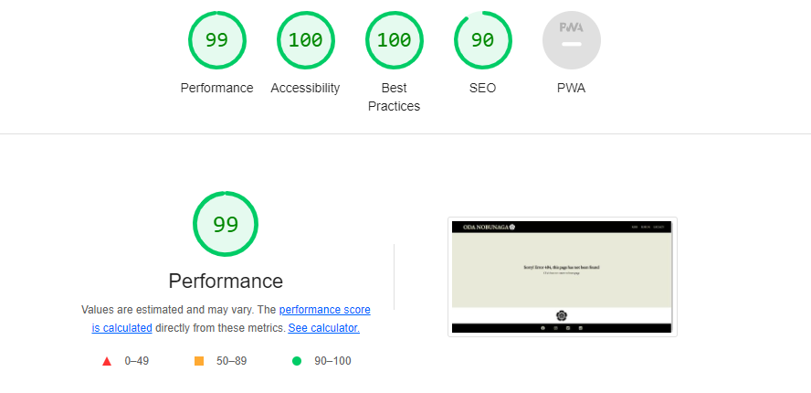

#### 404 Error Page Mobile Lighthouse Scores

#### Findings and Actions

Overall I am very pleased with the Lighthouse scores for my pages. Some of the first pages had lower scores on performance, this is due to there being more jpegs in these pages before I started using webp formats. I did explore swapping these, particularly on the background on the homepage, but whilst changing the images was relatively easy, recreating the styling for each image would simply be too time consuming with the project deadline.

The thankyou page also has a lower accessibilty score than the other pages, which are consistently very high. This is due to the automatic refresh on the page, which could damage the experience of that page for a user who was accessing through a screen reader or similar software. I wanted to keep this auto refresh in as I think its a nice feature to bring the user back to the home page, however I increased the time this would happen from 10 to 30 seconds. Although this did not improve the accessibility score, as the meta attribute was still present, it would in practice give a user more time to tab through the text before the screen was refreshed. However following further accessibility testing (see WAVE section below) this automatic refresh was removed altogether.

In the future I would look to replace all the images with webp format images as this would address most of the performance issues which impact the scores.

### WAVE Testing

Each page was assessed using the WAVE accessibility tool. Every page passed without any errors, please use the links below to view the scores for each page:

[Homepage WAVE Test](documentation/index-wave.PNG)
[Rise page WAVE Test](documentation/rise-wave.PNG)
[Reign page WAVE Test](documentation/reign-wave.PNG)
[Legacy page WAVE Test](documentation/legacy-wave.PNG)
[Form page WAVE Test](documentation/form-wave.PNG)
[Thankyou page WAVE Test](documentation/thankyou-wave-error.PNG)
[404 page WAVE Test](documentation/404-wave.PNG)

During this testing the auto-refresh on the thank you page was declared as an error. Because of this, and the impact on accessibility score also seen in Lighthouse testing, I decided to remove the automatic refresh. The page includes a clickable link back the homepage anyway, so the requirement for a user to continue using the site is still met. Whilst this is slightly more seamless with the automatic redirect, with the impact on accessibility and user experience, I felt removing the automatic refresh was the best approach.

## Bugs

### Solved Bugs

1. Navbar elements - The navbar elements were challenging to keep centered, particularly in creating the vertical display of items for smaller device screens. My mentor suggested using Flexbox instead of floats/padding and this provided a much simpler way to switch the row into a column at a particular pixel screen size. Some final fine tuning in removing padding at smaller screen sizes keeps the items centered.

2. Hover on Characters - Creating the pseudo class for hovering over the character links was challenging and presented a series of styling issues. Firstly creating a page layout which would display all 3 characters in even sections, then later to create a container which would wrap around the character image, and the date below it. Then the hover class against the container needed to be as circular as possible, without cutting off/overlapping other aspects. Re-coding this section as flexbox helped with this but it took a great of time with Chrome developer tools to identify styling which would display the character links in the desired way on larger and smaller screens. Eventually I deciced to have the characters take a vertical column display at a relatively large screen size which helped resolve the issue.

3. Scaling image size for smaller screens - Finding styling which resized images at smaller mobile-size screens suitably took time, many of the images would extend beyond the rest of the page width, causing a horizontal scroll bar to be displayed. After trying many combinations of padding/margin, I found styling of height: auto with width 100% (or vice versa), in combination with the image being displayed below its corresponding text, was on of the simplest and effective ways to scale images to screen size without impacting aspect ratio.

4. Legacy text and image sections - Whist not strictly a bug, the Betrayal, and in particular the Histroy and Legacy sections on the Legacy page, held a relatively small amount of text compared to the images. This left a lot of blank space below these text sections, which looked a bit odd. Vertically centering the text relative to the image with the align-items flex attribute meant that the text aligned more nicely to the image, but cut off the remaining background area which wasn't occupied by text, giving a mismatch between the top and bottom of the image and the text box. After experimenting with various possible solutions, I opted for a relatively simple padding-top rule for these sections where there is relativley little text compared to the size of the image, this keeps the text aligned better with the image without damaging the consistency of the overall display and navigation.

5. 'Oneliner' - The Story of Japans First Great Unifier - Originally the homepage was just the hero background image below the header, however I felt this was stark and something was needed to break up the image and give an idea on what the website was about. To introduce and position the 'oneliner' section I had to add position attributes to the background to make the oneliner absolute. This introduced issues for responsiveness, however the alternative was to try and float the text, which was difficult over different screen sizes. So although the oneliner required quite a lot of styling for one small aspect of the site, due to its absolute position, I felt this was the most efficient route and am pleased with the end result.

### Known Issues

1. On the homepage, the image for the legacy character, being actually 2 characters not 1, and a larger image just overlaps the black circle which is shown on hover for this link. This is a minor aethestic issue and has no a minor aspect on experince, the alternative to fix this would have meant having a larger circle and link for the legacy character, which would have been inconsistent and caused issues with the structure and styling.

2. Map on Rise Page - This map has proven challenging to get displaying correclty on different screen sizes. To include the entire map on a desktop size screen requires the background-size to be set very small, less than 50%, which looks bad very quickly on any screens smaller than 'full' monitor size. Therefore the background-size increases as a percentage as screen size gets smaller, which keeps the map a good size on the screen itself whilst also loosely maintaining a focus for the map to show the centre, in which Nobunagas territory is surrounded by enemies, which is the whole point of the graphic. However, with the zoom effect, at certain screen sizes parts of the map are cut off at certain points of the zoom. For the most part this isn't too problematic as the key centre of the map with surrounded Nobunaga is always shown, but it is visually distracting at certain screen sizes. I considered removing the zoom all together, but I felt even with some of the text being cut at certain screen sizes, the zoom effect was still good, and helped convey the point of being surrounded, so I kept it in.
